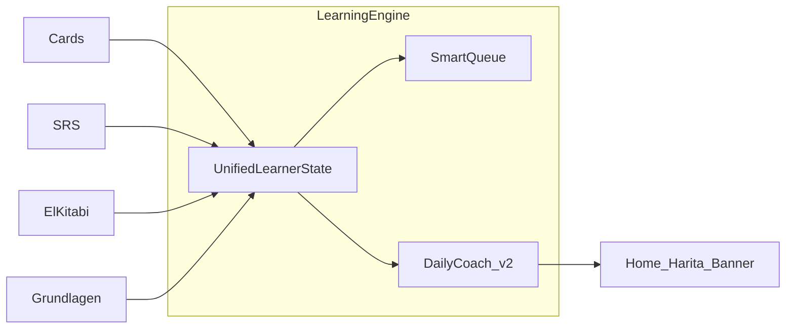

# German Coach Denetim Raporu — 2026-06

**Tarih:** 2026-06-29  
**Kapsam:** Kod tabanı denetimi (düzeltme yok). Plan: Genel denetim ve algoritma planı.  
**Ortam:** `apps/web` Next.js 14.2.35, `main` dalı.

---

## Özet

| Metrik | Değer |
|--------|-------|
| P0 (kritik) | 6 |
| P1 (yüksek) | 9 |
| P2 (orta) | 6 |
| Build | Başarılı (65 statik sayfa) |
| El-kitabı iç link audit | 16/16 geçerli |
| Unit test (SRS/progress) | Yok |

**Kayıt sistemi:** Bulut/kayıt yok. Tüm ilerleme `localStorage` + `sessionStorage` yedek. Senkronizasyon ve eksik sıfırlama en büyük risk.

**Algoritma önceliği:** Önce dürüst recall (exposure ≠ öğrenme), sonra SRS kuyruk + tek günlük hedef, ardından LearningEngine refactor.

### Öncelikli aksiyon listesi (düzeltme turu için)

1. **P0** `loadProgress` / `saveProgress` — `lastSavedAt` ile local vs session karşılaştırması; quota fallback senaryosu.
2. **P0** `AppErrorBoundary` — session yedeğini de temizle veya yedekten geri yüklemeyi engelle.
3. **P0** `/review` — Biliyorum / Bilmiyorum (mesleki kartlarla aynı sözleşme).
4. **P0** `/cards` — `continueLive` içinde `recordAnswer(..., true)` kaldır veya ayrı exposure kaydı.
5. **P0** `PatternQuiz` — son soruda çift sayım düzeltmesi.
6. **P1** `resetStudyProfile` — tüm ilgili `localStorage` anahtarlarını temizle; onay metnini güncelle.
7. **P1** Günlük hedefleri tek config’te birleştir (12 / 40 / 80 tutarsızlığı).
8. **P1** `buildReviewQueue` — yeni kelime skoru (1000) gecikmiş kartları geride bırakıyor.
9. **P2** LearningEngine + smoke/unit testler.

---

## Faz 0 — Otomatik taban çizgisi

### Build

```
npm run build (apps/web) → exit 0
Compiled successfully · 65 static pages
```

Uyarı: Edge runtime kullanan sayfalar statik üretim dışı (beklenen).

### El-kitabı link audit

```
npm run audit:el-kitabi → 16/16 geçerli
Çıktı: scripts/out/el-kitabi-links-audit.json
```

Script yalnızca `href: "..."` stringlerini tarar (`scripts/audit-el-kitabi-links.mjs`).

### Route envanteri

- **62** `page.tsx` dosyası (`apps/web/app/**/page.tsx`).
- **`/dashboard` yok** — ana panel `/` (UI-1).
- Tüm `practice.ts` `moduleHref` rotaları build çıktısında mevcut:
  - `/grundlagen/zahlen`, `conjugation`, `word-order`, `negation`, `artikel`, `dativ`, `prepositions`

### Audit script boşluğu (UI-7)

| Kaynak | Audit kapsamı |
|--------|----------------|
| `elKitabi/**/*.ts` içindeki `href:` | Evet (16 link) |
| `practice.ts` `moduleHref` | Hayır (7 rota, hepsi geçerli — manuel doğrulandı) |
| `?from=el-kitabi&section=` dönüş URL’leri | Hayır |

**Öneri:** `audit-el-kitabi-links.mjs` → `moduleHref` + query parametreli dönüş rotalarını ekle.

---

## 1. Kayıt sistemi (SAVE-*)

**Ana dosyalar:** `apps/web/lib/progress.ts`, `apps/web/lib/ProgressContext.tsx`, `apps/web/components/AppErrorBoundary.tsx`, `apps/web/components/ResetSRSButton.tsx`

### Mimari

```
Sayfalar → ProgressContext → saveProgress()
                              ├─ localStorage (german-coach-progress v3)
                              └─ sessionStorage (german-coach-progress-backup)
```

Bulut senkronizasyonu, hesap kaydı veya cihazlar arası merge yok.

### Bulgular

| ID | Öncelik | Konum | Sorun | Kanıt | Öneri | Durum |
|----|---------|-------|-------|-------|-------|-------|
| SAVE-1 | P0 | `progress.ts` `loadProgress` L396-405 | `localStorage` varsa **her zaman** döner; `sessionStorage` yedeği daha yeni olsa bile okunmaz. `saveProgress` local yazamazsa sadece session’a yazar (L472-474) → sonraki yüklemede **eski local** kazanır. | Kod akışı | `lastSavedAt` karşılaştırması; local bozuksa/eskise backup’ı promote et | Doğrulandı |
| SAVE-2 | P0 | `AppErrorBoundary.tsx` L47-54 | “Kayıtlı ilerlemeyi sıfırla” yalnızca `localStorage.removeItem("german-coach-progress")`. Session yedeği kalır → yenilemede `loadProgress` backup’tan geri yükler. | Kod | Her iki anahtarı sil veya backup’ı invalidate et | Doğrulandı |
| SAVE-3 | P1 | `ProgressContext.tsx` | Çok sekme: `storage` event ile cross-tab sync var (L105-110) ama aynı sekmede veya hızlı ardışık yazımda **last-write-wins**, merge yok. | Kod | İsteğe bağlı: `lastSavedAt` conflict UI veya merge stratejisi | Doğrulandı |
| SAVE-4 | P1 | `resetStudyProfile` L413-453 | Ana progress sıfırlanır (`elKitabi`, `grundlagen`, SRS vb.) ama **ayrı anahtarlar** kalır: speak, konus-dinle, cards ayarları, learner profile, diktat, dialogue, sentence engine, coach milestones, API keys, mektup-done, welcome flag, smart tips… | Grep envanteri | `resetStudyProfile` genişlet veya merkezi `clearAllCoachData()` | Doğrulandı |
| SAVE-5 | P2 | `UserProgress.lastCategory` | Alan tanımlı, default `null`; **hiçbir yerde yazılmıyor**. | Grep: yalnızca `progress.ts` | Kaldır veya `lastRoute` ile birleştir | Doğrulandı |
| SAVE-6 | P2 | `normalizeProgress` / `normalizeElKitabi` | `elKitabi.subsections` içindeki `quizBest`, `read` vb. tip doğrulaması yok; bozuk JSON sessizce kabul edilebilir. | L237-246 | Alt alanlar için şema doğrulama | Doğrulandı |

### Manuel test senaryoları (repro)

**SAVE-1 (quota fallback)**

1. `localStorage` dolu veya yazma hatası simüle et.
2. `saveProgress` session’a yazar, local eski kalır.
3. Sayfayı yenile → `loadProgress` eski local’i döner.

**SAVE-2 (error boundary)**

1. İlerleme oluştur.
2. Hata ekranı → “Kayıtlı ilerlemeyi sıfırla”.
3. Yenile → session yedeğinden ilerleme geri gelir.

**SAVE-3 (çok sekme)**

1. Sekme A ve B aç.
2. A’da kart çalış, B’de eski state ile çalış, B kaydeder.
3. A’nın yazdığı veri kaybolur (son yazan kazanır).

**SAVE-4 (profil sıfırla)**

1. Speak, kart ayarları, el-kitabi quiz yap.
2. Ayarlar / Review → “Göstergeleri sıfırla”.
3. Speak hafızası ve kart preset’leri kalır.

### Ayrı localStorage anahtarları (reset dışında kalanlar)

| Anahtar | Dosya |
|---------|-------|
| `german-coach-cards-settings` | `cardsSettings.ts` |
| `german-coach-speak-memory` | `speakStorage.ts` |
| `german-coach-konus-dinle` | `konusDinleStorage.ts` |
| `german-coach-learner-profile` | `learnerProfileStorage.ts` |
| `german-coach-diktat` | `diktatStorage.ts` |
| `german-coach-dialogues` | `dialogueStorage.ts` |
| `german-coach-user-api` | `userApiKeys.ts` |
| `german-coach-coach-milestones` | `coachMilestones.ts` |
| Sentence engine / das-ist / wo-ist lego | `*Storage.ts` |
| `german-coach-welcome-v2`, `german-coach-smart-tip-*` | UI flags |

---

## 2. Mantık hataları (BUG-*)

| ID | Öncelik | Konum | Sorun | Kanıt | Öneri | Durum |
|----|---------|-------|-------|-------|-------|-------|
| BUG-1 | P0 | `review/page.tsx` L140-146 | `continueLive` → `recordSRSReview(..., **true**)` her “Sonraki kelime”de. Biliyorum/Bilmiyorum yok. | Mesleki: `recordSRSReview(..., true/false)` (`mesleki/page.tsx` L86-93) | WordCard `showActions` + doğru/yanlış butonları | Doğrulandı |
| BUG-2 | P0 | `cards/page.tsx` L192-199 | Dinleme/gezinme modunda `continueLive` → `recordAnswer(..., **true**)` — mastery ve günlük `newWordsLearned` şişer. | Kod; `WordCard`’da `showActions` yok | Exposure kaydı veya kayıt yok; recall ayrı | Doğrulandı |
| BUG-3 | P0 | `PatternQuiz.tsx` L25-38 | Son soruda: `handleAnswer` `correct` artırır, `handleNext` `runningCorrect = correct + (thisCorrect ? 1 : 0)` → **çift sayım** (ör. 5 soruda 6/5). | Kod akışı | Son soruda yalnızca `correct` state’ini kullan | Doğrulandı |
| BUG-4 | P1 | `srs.ts` `buildReviewQueue` L149-162 | Yeni kelimeler `score: 1000`; gecikmiş kartlar en fazla `500 + overdue`. Yeni kelimeler **her zaman** önce gelir. | Kod | Yeni/gün limiti; overdue önceliği artır | Doğrulandı |
| BUG-5 | P1 | `ElKitabiPracticeBridge.tsx` L107, `ElKitabiToc.tsx` L17 | Zayıf = `finalScore < quizTotal` (2 soruda 1 doğru = zayıf). TOC “T” = `quizBest > 0` (1/2 yeterli). | Kod | Eşik %80; TOC “T” = tamamlanmış test | Doğrulandı |

### Repro: BUG-3 (PatternQuiz)

1. Grundlagen → Pattern trainer → herhangi bir pattern → quiz.
2. Tüm soruları doğru cevapla.
3. `onFinish` skoru `questions.length + 1` olabilir → `markPatternCompleted` yanlış skor kaydeder.

### Repro: BUG-1 (Review)

1. `/review` aç, kartı çevirmeden “Sonraki kelime”.
2. `recordSRSReview(..., true)` çalışır — kullanıcı hatırlamadı bile olsa SRS ilerler.

### Tutarsız kopya (BUG-6)

| ID | Öncelik | Konum | Sorun |
|----|---------|-------|-------|
| BUG-6 | P1 | `readinessEngine.ts` GUIDE_COPY `srs` L78 | “Biliyorum / Tekrar et” yazar; `/review` UI’da bu butonlar yok |

---

## 3. Tutarlılık (CON-*)

| ID | Öncelik | Alan | Tutarsızlık | Kanıt | Öneri |
|----|---------|------|-------------|-------|-------|
| CON-1 | P1 | Günlük hedef | `learningCoach.ts` **12** kelime (`CARDS_TARGET`); `DEFAULT_DAILY_GOALS.newWords` **40**; `srsReviews` **80**; dinleme görevi **30 dk** | `dailyGoals.ts`, `learningCoach.ts`, `readinessEngine.ts` L574 | Tek `DailyCoachConfig` |
| CON-2 | P1 | SRS skoru | `calcSrsScore` uzun vadeli skor için `calcAccuracy(progress)` kullanır; `calcAccuracy` **yalnızca bugünkü** `dailyStats.correct/wrong` (L569-574) | `readinessEngine.ts` L367-374 | Rolling accuracy veya SRS-specific metrik |
| CON-3 | P1 | Günlük plan | `WORKFLOW_ORDER`: srs, new, hoeren, lesen, schreiben, sprechen, listen — **speakClass, speakExercise, dialogues** listede yok | `readinessEngine.ts` L123-131 vs L546-577 | WORKFLOW_ORDER genişlet veya görevleri birleştir |
| CON-4 | P2 | El-kitabı | **9/53** alt bölümde practice bridge; özet yalnızca pilot ID’leri sayar (`EL_KITABI_PRACTICE_IDS`) | `practice.ts` | Kademeli genişletme planı |
| CON-5 | P1 | Reset onay | `ResetSRSButton` El Kitabı / Grundlagen / ayrı storage’ları **saymıyor** | `ResetSRSButton.tsx` L6-12 | Metin + gerçek kapsam hizala |
| CON-6 | P2 | El-kitabı dönüş | `possessives` sayfasında `ElKitabiReturnBanner` yok; el-kitabı roadmap linkleri `?section=` **eklemiyor** (practice bridge ekliyor) | `possessives/page.tsx`, `roadmap.ts` | Banner + roadmap query |
| CON-7 | P2 | A2 gramer | `A2_GRAMMAR_MANIFEST`: Perfekt ve Nebensatz → `/grundlagen/roadmap` (içerik yok); tamamlanma `a2-section` stub | `manifest.ts` L286-310 | A2 modülleri veya “yakında” kilidi |

### Progress sözleşmesi özeti

| Modül | Recall kaydı | Exposure kaydı |
|-------|--------------|----------------|
| Mesleki kartlar | `recordSRSReview` true/false | — |
| Review (SRS) | Her zaman `true` | — |
| Cards (dinle) | Her geçişte `true` | — |
| Quiz | `recordAnswer` doğru/yanlış | — |
| El-kitabı | Mini quiz skoru | `recordElKitabiRead` |

---

## 4. UI / rota (UI-*)

| ID | Öncelik | Rota / bileşen | Bulgu | Tür | Öneri |
|----|---------|----------------|-------|-----|-------|
| UI-1 | P2 | `/dashboard` | Route yok; ana sayfa `/` | Bilgi | Dokümantasyon / harita linklerini kontrol et |
| UI-2 | P2 | `/harita` | `locked` / `future` düğümler tıklanamaz (Link yok) | Bilinçli | Tooltip “önce X’i tamamla” |
| UI-3 | P2 | `/speak` | API anahtarı yoksa dersler çalışır; AI geri bildirim sınırlı (`ayarlar` açıklıyor) | Bilinçli | Eksik anahtarda net banner |
| UI-4 | P2 | `/grundlagen/possessives` | `ElKitabiReturnBanner` eksik | Boşluk | Diğer modüllerle hizala |
| UI-5 | P2 | El-kitabı roadmap tablosu | Modül linkleri düz `href` (`roadmap.ts`); dönüş `section` yok | Zayıf UX | `elKitabiModuleHref` benzeri |
| UI-6 | P1 | `/review` | Kullanıcıya “Sonraki kelime” = başarı; mesleki’de açık grading | Bug UX | BUG-1 ile birlikte düzelt |
| UI-7 | P2 | Audit script | `moduleHref` kapsam dışı | Araç | Script genişlet |
| UI-8 | P2 | `/grundlagen/roadmap` B1 sekmesi | “Yakında” placeholder | Bilinçli | — |
| UI-9 | P2 | Sınav (`exam/hoeren`, `lesen`) | `disabled={!allAnswered}` — cevapsız değerlendirme yok | Bilinçli | — |

### Sayfa tarama matrisi (statik + kod incelemesi)

| Rota grubu | Durum | Not |
|------------|-------|-----|
| `/`, `/harita` | OK | Dashboard = `/` |
| `/cards`, `/review` | Sorunlu | BUG-1, BUG-2 |
| `/mesleki` | OK | Doğru SRS grading |
| `/grundlagen/*` | Kısmi | possessives banner; PatternQuiz skor |
| `/rehber/el-kitabi` | OK | Hash + pilot bridge; 9/53 |
| `/speak`, `/konus-dinle` | OK | API opsiyonel |
| `/exam/*` | OK | Submit korumalı |
| `/a2/cards`, `/a2/words` | OK | Build’de mevcut |

---

## 5. Algoritma yol haritası

### Mevcut durum

Algoritmalar modül modül dağınık: `srs.ts`, `readinessEngine.ts`, `learningCoach.ts`, `learningMap.ts`, `elKitabi/practice.ts`, `progress.recordAnswer`.

### Hedef: LearningEngine (önerilen)



### İlkeler

1. **Tek yazma API’si:** `recordExposure`, `recordRecall`, `recordRead` — modüller doğrudan `recordAnswer` çağırmaz.
2. **Exposure ≠ recall:** Dinleme, kart gezinme, el-kitabı okuma mastery artırmaz.
3. **SmartQueue:** Gecikmiş SRS + zayıf el-kitabi alt bölüm + grundlagen hata kalıbı → günlük **12–15** maddelik karışık kuyruk (sayı tek config’te).
4. **SRS düzeltmesi:** Overdue önceliği; günlük yeni kart limiti; review’da honest grading.
5. **El-kitabı adaptif:** Quiz &lt; %80 → modül; %100 + okundu → sonraki bölüm; TOC “T” = eşik geçildi.
6. **Readiness v2:** `WORKFLOW_ORDER` ↔ `todayTasks` senkron; accuracy rolling window.

### Uygulama sırası (onay sonrası PR’lar)

| Aşama | Kapsam | Maddeler |
|-------|--------|----------|
| PR-1 P0 | Dürüst kayıt | SAVE-1, SAVE-2, BUG-1, BUG-2, BUG-3 |
| PR-2 P1 | Tutarlılık | SAVE-4, CON-1, CON-2, CON-3, BUG-4, reset copy |
| PR-3 P2 | Motor | LearningEngine refactor, el-kitabi genişletme, audit script, unit testler |

---

## Ek A — Komut çıktıları

### Build (özet)

```
✓ Compiled successfully
✓ Generating static pages (65/65)
```

### audit:el-kitabi

```
Toplam link: 16
Gecerli:      16
Eksik:        0
```

---

## Ek B — Önerilen testler

Repoda `*.test.ts` / vitest / jest **yok**. Öncelikli unit test adayları:

| Modül | Test |
|-------|------|
| `buildReviewQueue` | Yeni vs overdue sıralama; limit |
| `processSRSReview` | Doğru/yanlış interval; mastered eşiği |
| `loadProgress` | Local eski + session yeni → doğru kaynak |
| `resetStudyProfile` | Tüm anahtarların temizlendiği |
| `PatternQuiz` | Son soru skoru = `questions.length` |
| `recordAnswer` | Exposure path mastery artırmamalı |
| `calcAccuracy` | Günlük vs rolling ayrımı (refactor sonrası) |

### Smoke (manuel veya Playwright)

1. `/review` — flip → Bilmiyorum → SRS step gerilemeli.
2. `/cards` — sonraki kelime → `newWordsLearned` artmamalı (dinleme modu).
3. Çok sekme — iki sekmede farklı kelime, kayıt tutarlılığı.
4. Error boundary reset — ilerleme geri gelmemeli.
5. El-kitabı `#ch02-5` — hash scroll + practice bridge.

---

## Ek C — El-kitabı kapsam

| Metrik | Değer |
|--------|-------|
| Toplam alt bölüm (ch01–ch11) | 53 |
| Practice bridge | 9 |
| Return banner modülleri | 8 (possessives hariç) |
| İç link audit | 16/16 |

Pilot practice ID’leri: `ch01-3`, `ch02-2`, `ch02-4`, `ch02-5`, `ch03-1`, `ch03-2`, `ch04-1`, `ch06-1`, `ch06-2`.

---

*Bu rapor yalnızca denetim çıktısıdır; kod değişikliği içermez.*

1. Kayıt yükleme düzeltmesi (local vs session, `lastSavedAt`)
2. Hata ekranı sıfırlama — session yedeğini de temizleme
3. Review sayfası — Biliyorum / Bilmiyorum
4. Cards sayfası — dinlemede yanlış mastery kaydı kaldırma
5. PatternQuiz — son soru çift sayım hatası
6. Profil sıfırlama — tüm localStorage anahtarları
7. Günlük hedefleri tek yerde birleştirme (12 / 40 / 80)
8. SRS kuyruk önceliği — gecikmiş kartlar önce
9. El-kitabı test eşiği ve TOC “T” kuralı
10. Possessives — el-kitabı dönüş bandı
11. Reset onay metni güncelleme
12. El-kitabı audit script — `moduleHref` kapsamı
13. LearningEngine — exposure / recall ayrımı
14. SmartQueue — günlük karışık öğrenme kuyruğu
15. Unit ve smoke testler (SRS, progress, PatternQuiz)